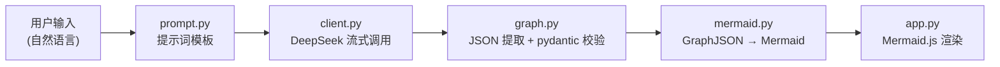

# 🕸️ LLM Graph → Mermaid

**用自然语言一键生成 Mermaid 流程图。** 输入一段业务流程 / 系统架构 / 数据管道的文字描述，由 DeepSeek 模型生成结构化的 GraphJSON（节点 + 边），并在 Streamlit 界面中实时渲染为可视化流程图，支持流式输出、增量优化、手动编辑与导出。

> 本项目是 [`llm-graph-mermaid`](../../llm-graph-mermaid) v1（TypeScript + Anthropic SDK 骨架）的 **全量 Python 重写版**：LLM 由 Claude 换为 DeepSeek（OpenAI 兼容协议），前端改为 Streamlit 单文件启动。

---

## ✨ 功能特性

- **自然语言 → GraphJSON → Mermaid**：内置精心设计的提示词模板，输出经过 pydantic 严格校验的结构化图数据（节点 ID 去重、边引用检查、类型归一化）
- **八种图表模式**：**自动判断（默认，由模型选择最合适的类型并在结果中标注）**、简单流程、通用流程、工作流程、泳道（跨职能）、状态机、系统架构、数据管道；泳道图按角色分组、状态机图以 stateDiagram-v2 渲染
- **流式生成**：逐字显示模型输出过程（可关闭）
- **增量优化**：对当前图表提出改进要求（如「在发货前增加库存检查」），模型返回修订后的完整图表
- **可视化 + 代码双视图**：Mermaid.js 实时渲染；Mermaid 源码可直接手动编辑并即时生效
- **多主题与布局**：default / neutral / dark / forest 四种 Mermaid 主题，上下（TB）/ 左右（LR）两种布局方向
- **导出**：下载 `.mmd`（Mermaid 源码）与 `.json`（GraphJSON）
- **可插拔模型**：默认对接 DeepSeek 开放平台，任何 OpenAI 协议兼容接口（火山方舟、SiliconFlow、OpenRouter…）改两个参数即可接入

---

## 🚀 快速开始

### 1. 准备环境

要求 **Python ≥ 3.10**（推荐 3.12）。

```powershell
# Windows PowerShell
git clone <your-repo-url> llm-graph-mermaid
cd llm-graph-mermaid
python -m venv .venv
.venv\Scripts\Activate.ps1
pip install -r requirements.txt
```

```bash
# macOS / Linux
git clone <your-repo-url> llm-graph-mermaid
cd llm-graph-mermaid
python3 -m venv .venv
source .venv/bin/activate
pip install -r requirements.txt
```

### 2. 配置 API Key

```bash
cp .env.example .env
```

编辑 `.env`，填入你的 DeepSeek API Key（在 [DeepSeek 开放平台](https://platform.deepseek.com/api_keys) 免费注册获取）：

```dotenv
DEEPSEEK_API_KEY=sk-xxxxxxxxxxxxxxxx
DEEPSEEK_BASE_URL=https://api.deepseek.com
DEEPSEEK_MODEL=deepseek-flash
```

> 也可以跳过 `.env`，启动后在应用左侧「🔗 连接配置」中直接填写。

### 3. 启动

```bash
streamlit run app.py
```

浏览器会自动打开 `http://localhost:8501`。左侧输入流程描述（或点击示例按钮），点击 **🚀 生成图表** 即可。

---

## ⚙️ 配置说明

### 环境变量

| 环境变量 | 默认值 | 说明 |
| --- | --- | --- |
| `DEEPSEEK_API_KEY` | （无，必填） | API 密钥 |
| `DEEPSEEK_BASE_URL` | `https://api.deepseek.com` | OpenAI 兼容接口地址 |
| `DEEPSEEK_MODEL` | `deepseek-flash` | 模型名 |
| `DEEPSEEK_TEMPERATURE` | `0.7` | 采样温度 |
| `DEEPSEEK_MAX_TOKENS` | `2048` | 输出 token 上限 |
| `DEEPSEEK_THINKING` | （空 = 跟随模型默认） | 思考模式开关（DeepSeek V4 专属）：`true` / `false` |

以上全部可以在应用侧边栏中临时覆盖（仅当前会话生效）。侧边栏还提供「思考模式」开关（DeepSeek V4 专属）：`deepseek-flash` 默认开启思考模式，本应用生成结构化 JSON 建议保持「关闭」，响应更快、成本更低。

### 模型选择

| 模型名 | 说明 |
| --- | --- |
| `deepseek-flash` | **默认**，当前版本 DeepSeek-V4.1-Flash：1M 上下文、最高 384K 输出，支持思考/非思考双模式与视觉输入，价格最低 |
| `deepseek-v4-pro` | DeepSeek-V4-Pro-0813，能力更强、价格更高，复杂架构图可尝试 |
| `deepseek-v4-flash` | 旧名称，仍被接受：请求由 DeepSeek-V4.1-Flash 服务，按 Flash 价格计费 |

### 接入其它 OpenAI 兼容平台

| 平台 | Base URL | 模型名示例 |
| --- | --- | --- |
| DeepSeek 官方 | `https://api.deepseek.com` | `deepseek-flash` / `deepseek-v4-pro` |
| 火山方舟 Ark | `https://ark.cn-beijing.volces.com/api/v3` | `deepseek-v3-0324` / `ep-2024xxxx` 接入点 |
| SiliconFlow | `https://api.siliconflow.cn/v1` | `deepseek-ai/DeepSeek-V3` |
| OpenRouter | `https://openrouter.ai/api/v1` | `deepseek/deepseek-chat` |

在侧边栏「连接配置」中修改 Base URL 与模型名即可，无需改代码。

---

## 🖱️ 使用指南

1. **选择图表类型** —— **自动判断（auto，默认，模型根据描述自行选择并在结果中标注类型）**；也可手动指定：简单流程（simple）/ 通用（general）/ 工作流程（workflow）/ 泳道（swimlane）/ 状态机（state）/ 架构（architecture）/ 管道（pipeline）
2. **输入描述** —— 手动输入，或点击示例按钮快速填充
3. **生成图表** —— 默认流式输出；生成后自动完成 JSON 提取 → 结构校验 → Mermaid 渲染
4. **优化图表** —— 在「🔧 优化当前图表」中用自然语言描述改动，模型返回修订版
5. **手动微调** —— 「📝 Mermaid 代码」标签页可直接编辑源码，「应用编辑」后立即重新渲染
6. **导出** —— 下载 `.mmd` 或 `.json`

---

## 🧩 GraphJSON 格式

LLM 输出与导出的 `.json` 均为如下结构（`examples/sample_graph.json` 是一个完整示例）：

```json
{
  "version": "1.0",
  "title": "用户登录流程",
  "description": "简要描述",
  "direction": "TB",
  "nodes": [
    { "id": "n1", "label": "开始", "type": "start" },
    { "id": "n3", "label": "验证码是否正确", "type": "decision" },
    { "id": "n8", "label": "登录成功", "type": "end" }
  ],
  "edges": [
    { "from": "n1", "to": "n3" },
    { "from": "n3", "to": "n8", "label": "通过" }
  ]
}
```

| 字段 | 说明 |
| --- | --- |
| `nodes[].type` | `start`（开始）/ `process`（处理）/ `decision`（决策）/ `end`（结束）/ `subprocess`（子流程） |
| `nodes[].description` | 可选的详细描述 |
| `edges[].label` / `condition` | 边标签；决策分支建议携带「是 / 否 / 成功 / 失败」类条件标签 |
| `direction` | `TB`（从上到下）或 `LR`（从左到右） |
| `diagram` | 渲染种类：`flowchart`（流程图，默认）或 `state`（状态机图，以 stateDiagram-v2 渲染） |
| `type` | 图表类型标识（`simple` / `general` / `workflow` / `swimlane` / `state` / `architecture` / `pipeline`）；自动判断模式下由模型填写，用于界面展示，无法识别时自动置空 |
| `nodes[].lane` | 泳道归属（泳道图使用）；渲染时按 lane 自动分组为 Mermaid subgraph 泳道 |

节点类型与形状的映射：start/end → 体育场形、process → 矩形、decision → 菱形、subprocess → 双线矩形，并按类型自动着色。

---

## 🏗️ 项目结构

```text
llm-graph-mermaid/
├── app.py                     # Streamlit 应用入口（UI + 交互编排）
├── llm_graph/                 # 核心 Python 包
│   ├── __init__.py            # 包导出
│   ├── config.py              # 配置：环境变量默认值 + 侧边栏覆盖
│   ├── graph.py               # GraphJSON 模型 / 解析 / 校验（pydantic v2）
│   ├── prompt.py              # 提示词模板（生成 / 按场景 / 优化）
│   ├── client.py              # DeepSeek（OpenAI 兼容）流式客户端
│   └── mermaid.py             # GraphJSON → Mermaid flowchart 渲染
├── examples/
│   └── sample_graph.json      # 内置示例（应用首屏展示）
├── scripts/
│   └── smoke_test.py          # 冒烟测试（不调用 LLM，无 API Key 也能跑）
├── requirements.txt
├── .env.example
└── README.md
```

### 调用链路



### 本地测试

```bash
python scripts/smoke_test.py
```

验证数据模型、容错 JSON 提取、Mermaid 渲染与提示词构建，不消耗任何 API 额度。

---

## 🔁 从 v1（TypeScript）迁移

原 `src/llm/*.ts` 与 `tsconfig.json` 已移除（可在 git 历史中找回），逻辑对应关系：

| v1（TypeScript） | v2（Python） | 变化 |
| --- | --- | --- |
| `src/llm/client.ts` | `llm_graph/client.py` | Anthropic SDK → OpenAI 兼容 SDK；模型 → DeepSeek；增加流式与友好错误映射 |
| `src/llm/prompt.ts` | `llm_graph/prompt.py` | 内容保留并强化「只返回 JSON」约束，系统提示词与用户提示词分离 |
| `src/types/graph`（zod，未随仓库提供） | `llm_graph/graph.py` | zod schema → pydantic v2，增加括号配对容错解析与类型归一化 |
| （无界面实现） | `app.py` | 全新 Streamlit 界面 |
| `tsconfig.json` | `requirements.txt` | Node 工具链 → Python venv |

---

## ❓ FAQ

**Q: 提示「API Key 无效或未授权（401）」？**
检查侧边栏 / `.env` 中的 Key 是否正确、是否属于对应平台（DeepSeek 的 Key 不能用于火山方舟的 Base URL）。

**Q: 提示「接口或模型不存在（404）」？**
Base URL 与模型名不匹配。注意 DeepSeek 官方地址为 `https://api.deepseek.com`（不要带 `/v1` 也能工作，带 `/v1` 亦可）；火山方舟需使用其专属地址与 `ep-` 接入点。

**Q: 生成失败，提示 JSON 不完整 / 校验失败？**
模型输出可能被 `max_tokens` 截断或发生漂移。依次尝试：调大侧边栏 Max Tokens → 调低 Temperature → 重试。「🗂️ 原始输出」标签页可查看模型原文帮助定位。解析器本身已能容忍代码块包裹与前后杂讯。

**Q: 图表区域显示「Mermaid.js 渲染脚本加载失败」？**
运行环境无法访问 `cdn.jsdelivr.net`。可离线下载 `mermaid.min.js` 后修改 `app.py` 中 `render_mermaid` 的 `<script src>` 指向本地文件，或改用 `streamlit-mermaid` 组件。

**Q: DeepSeek 的 Flash 模型是什么？**
`deepseek-flash` 是 DeepSeek 当前的主力模型（版本 DeepSeek-V4.1-Flash），本应用已将其设为默认：1M 上下文、最高 384K 输出，支持思考/非思考双模式与视觉输入。旧名称 `deepseek-v4-flash` 仍被接受，但请求会由 V4.1-Flash 接管并按 Flash 价格计费。注意 Flash **默认开启思考模式**，生成流程图这类结构化任务建议在侧边栏关闭思考以提速省钱。官方定价见 [Models & Pricing](https://api-docs.deepseek.com/quick_start/pricing)。

---

## 📄 License

MIT
